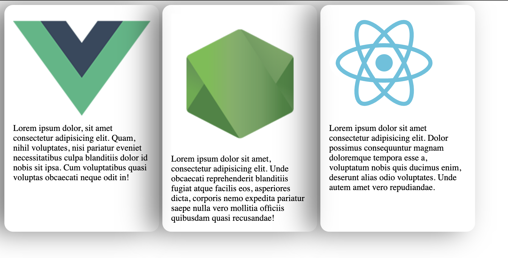

# What is this?

You can create responsive css grid cards and layouts with minimum effort. 
Also with this package you can set the perfect shadows for your html elements.

# Installation

`npm i csslayouts`

then...

You can use these modules easy with importing them.

***

import { shadowmaker, cardsContainerMaker, cardMaker } from 'shadowoptions';

cardsContainerMaker({
    cards_size: 'small'
});

cardMaker({
    card_shadow: true
});

***

# Options 

At the moment, there are 3 supported sizes.
*cards_size* - small, medium and large 

And you are also able to add cool shadows to them with cardMaker.
*card_shadow* - boolean (Defaults to false).

